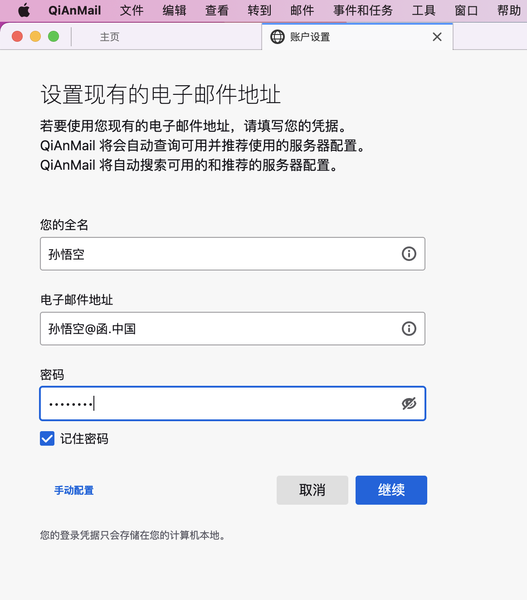
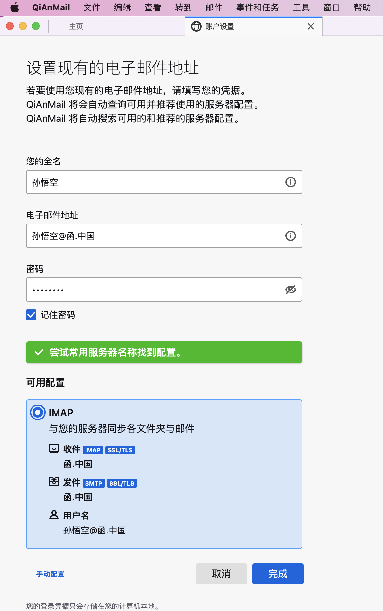
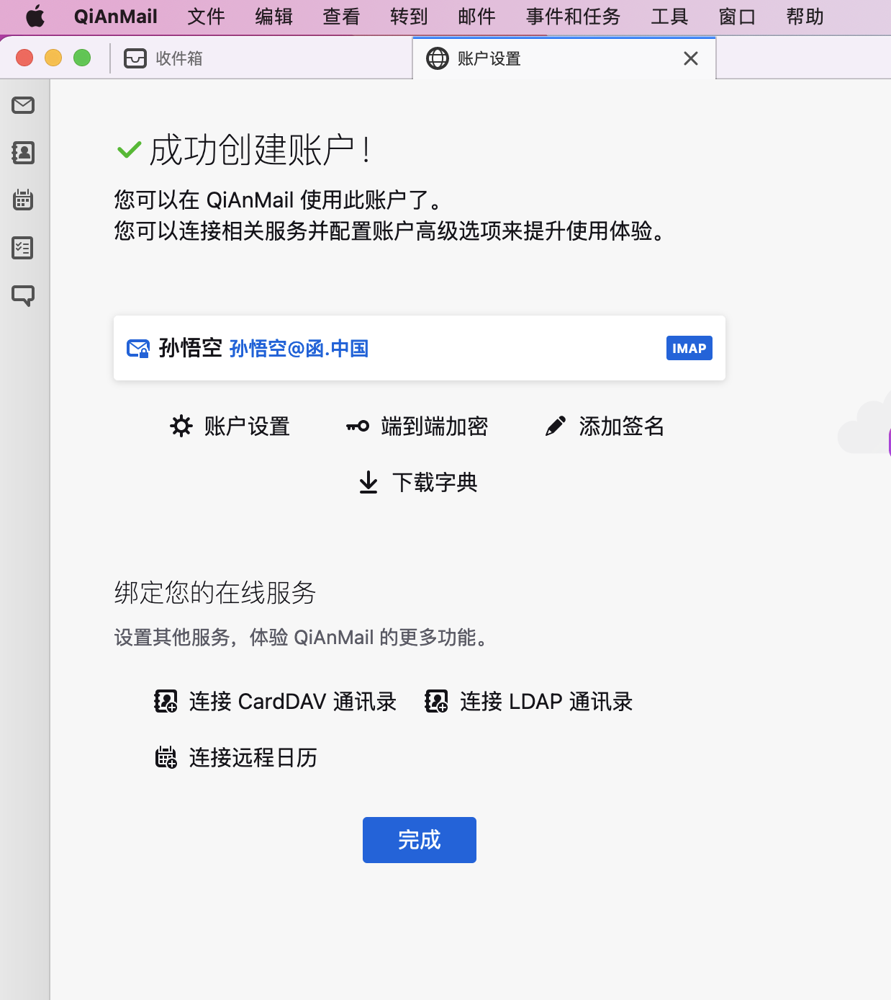
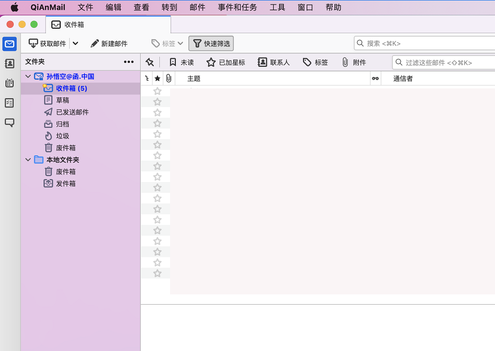

# IDN Mail Server and Clients

#### Introduction
International Domain Name Email System and Clients.

Supports Android、Windows、macOS

Client based on Thunderbird

Open for request for other language clients。

#### Installation
Download the app and install.

#### Usage
Run the Mail Client App.
Input the IDN email address and password, click Continue, Done!

Apply for IDN email: [https://函.中国](https://函.中国)

Support End to End Encryption

